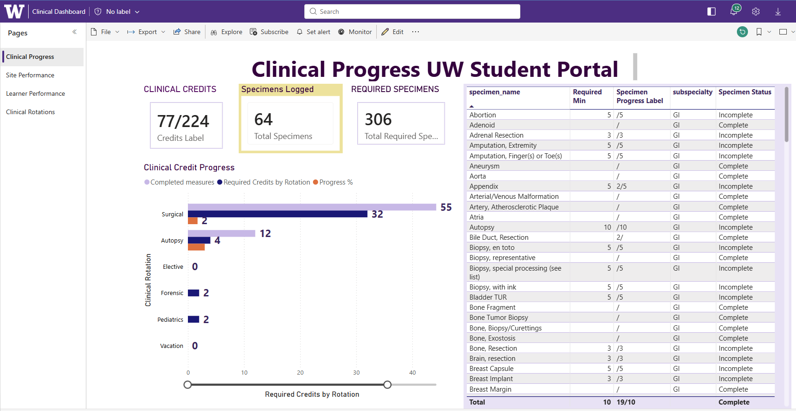
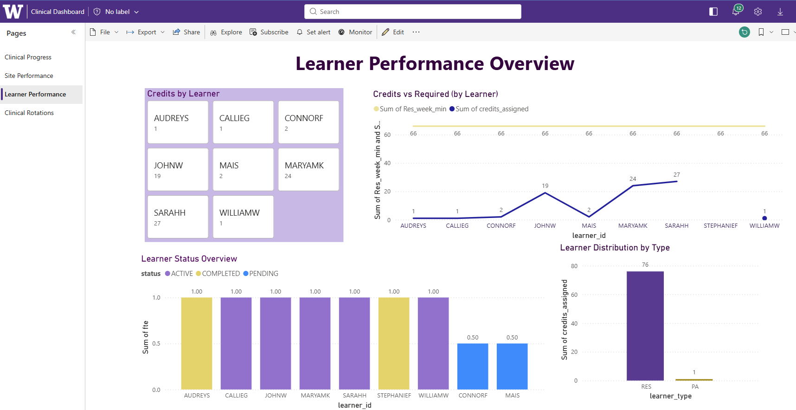
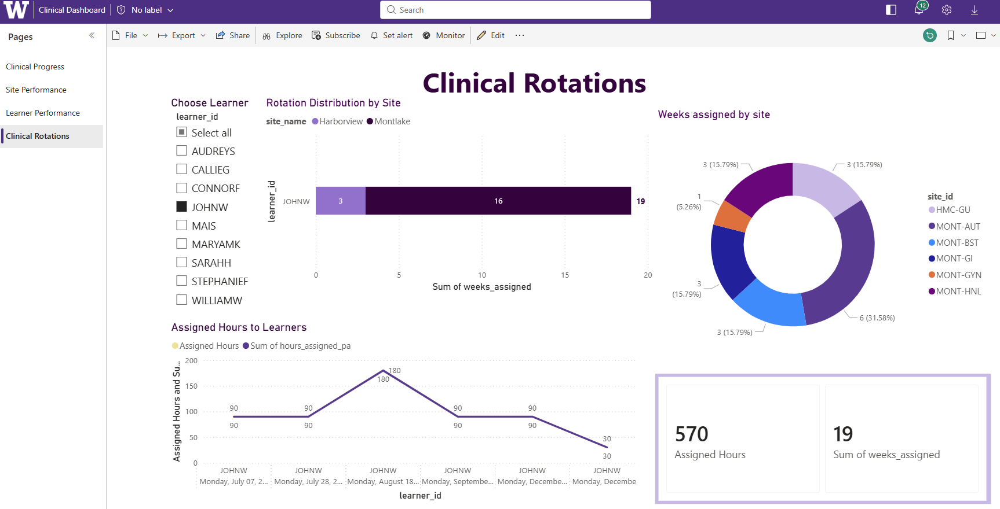

# 🏥 Clinical Student Portal Dashboard (Power BI)

## 📌 Project Overview

This project is an interactive Power BI dashboard designed to track clinical progress, specimen completion, and student performance in a healthcare education setting.

The goal was to move away from manual Excel tracking and create a centralized, easy-to-use tool that gives both students and program administrators clear visibility into progress and requirements.

---

## 🎯 Business Problem

Clinical programs often track student progress across multiple rotations, sites, and specimen requirements using spreadsheets. This makes it difficult to:

* Monitor progress in real time
* Identify gaps in required clinical experience
* Compare performance across sites and learners
* Generate clear, consistent reports

---

## 💡 Solution

I designed a multi-page Power BI dashboard that consolidates all clinical data into a single platform. It allows users to:

* Track completed vs required clinical credits
* Monitor specimen completion status
* Analyze site performance across rotations
* View learner-level progress and distribution
* Follow trends over time

---

## 🖼 Dashboard Preview

### 🔹 Clinical Overview (KPI + Progress Tracking)

### 🔹 Site Performance Analysis

### 🔹 Learner Performance Insights

### 🔹 Clinical Rotations & Assignments

---

## 🧠 Key Features

* KPI tracking for clinical credits and specimen requirements
* Progress indicators (Complete / Incomplete logic)
* Site-level performance comparison
* Learner-level analytics and distribution
* Weekly progress trend visualization
* Interactive filtering using slicers

---

## 🛠 Tools & Technologies

* Power BI Desktop
* Excel
* DAX (Data Analysis Expressions)
* Power Query

---

## 🧩 Data & Modeling

* Built structured data model using fact and dimension tables
* Cleaned and transformed raw Excel data in Power Query
* Created calculated measures for:

  * Progress %
  * Completion status
  * KPI indicators

---

## 🚀 Outcome

This dashboard improves visibility into clinical training progress and helps quickly identify missing requirements or underperforming areas. It transforms static data into actionable insights that can support better decision-making.

---

## ⚠️ Note

Data used in this project has been anonymized. This dashboard is intended to simulate a real-world clinical student tracking system.

## 🧩 Data Model / Schema

This dashboard is built on a structured data model designed to support flexible filtering and accurate reporting across multiple dimensions such as learners, sites, rotations, and specimens.

The model supports relationships between datasets and enables efficient calculations for KPIs, progress tracking, and performance analysis.
