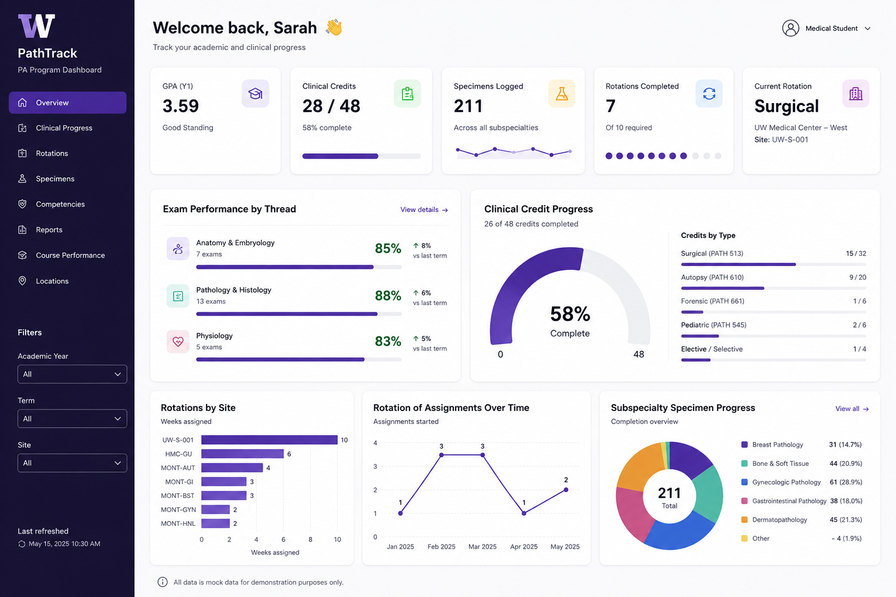
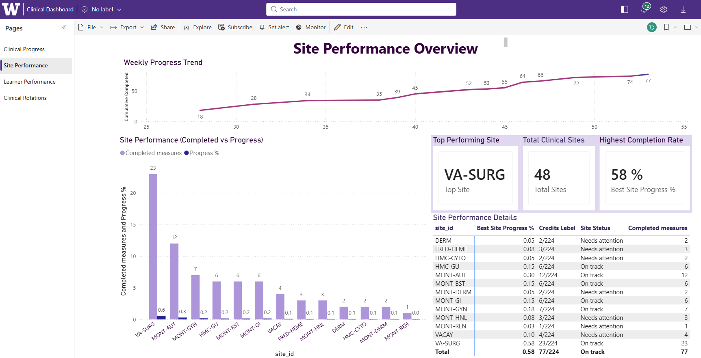
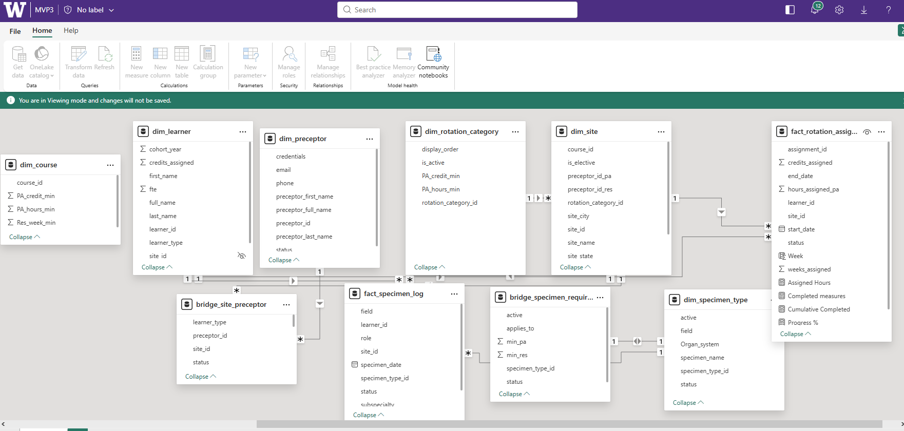

# 🏥 Clinical Student Portal Dashboard (Power BI)

## 📌 Project Overview

This project is an interactive Power BI dashboard designed to track clinical progress, specimen completion, rotations, and student performance within a healthcare education environment.

The goal was to replace manual Excel-based tracking with a centralized reporting solution that provides students, faculty, and program leadership with clear visibility into academic and clinical progress.

---

## 🎯 Business Problem

Clinical programs often manage student progress across multiple rotations, sites, and specimen requirements using disconnected spreadsheets and manual reporting processes. This creates challenges in:

* Monitoring student progress in real time
* Identifying missing clinical requirements
* Comparing learner and site performance
* Maintaining consistent operational reporting
* Reducing manual tracking and reporting effort

---

## 💡 Solution

Designed a multi-page Power BI dashboard consolidating clinical and academic data into a centralized reporting platform. The solution enables users to:

* Track completed vs required clinical credits
* Monitor specimen completion status
* Analyze site and rotation performance
* View learner-level progress and KPI metrics
* Identify trends and reporting gaps over time

---

## 🖼 Dashboard Preview

### 🔹 Clinical Overview

### 🔹 Site Performance Analysis

### 🔹 Learner Performance Insights

### 🔹 Clinical Rotations & Assignments

---

## 🧠 Key Features

* KPI tracking for clinical credits and specimen requirements
* Progress indicators and completion tracking
* Site-level performance comparison
* Learner-level analytics and distribution
* Interactive filtering using slicers and drilldowns
* Trend analysis across rotations and reporting periods

---

## 🛠 Tools & Technologies

* Power BI Desktop
* Power Query
* DAX (Data Analysis Expressions)
* Excel
* Data Visualization

---

## 🧩 Data & Modeling

Built a structured semantic data model using fact and dimension tables to support scalable filtering, KPI calculations, and cross-system reporting.

### 🔹 Data Model / Schema

The model supports relationships across learners, rotations, sites, and specimen tracking datasets while enabling efficient calculations for progress monitoring and operational reporting.

---

## 🚀 Outcome

The dashboard improves visibility into clinical training progress while reducing manual reporting effort and improving operational tracking consistency. The project demonstrates how healthcare education data can be transformed into interactive reporting solutions that support faster and more informed decision-making.

---

## ⚠️ Note

Data used in this project has been anonymized. This dashboard is intended to simulate a real-world clinical student tracking and reporting environment.
